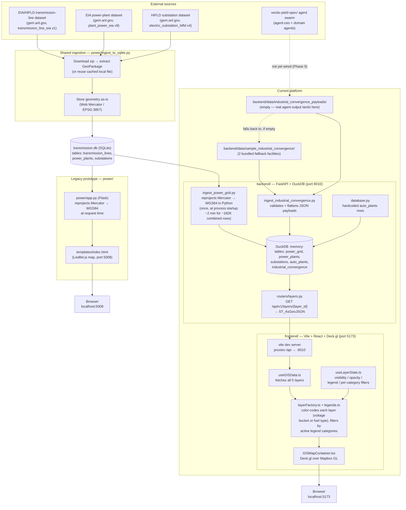

# Vectis Yield

A geospatial platform for tracking industrial/energy "convergence" — where auto
manufacturing, defense hardware, robotics, and grid capacity overlap — layered
on top of real U.S. transmission-grid and power-generation data.

There are currently **two codebases in this repo**:

- **`backend/` + `frontend/`** — the target architecture (FastAPI + DuckDB
  spatial backend, React + Deck.gl + Mapbox frontend). This is what's under
  active development and what the rest of this doc describes.
- **`power/`** — an earlier Flask + SQLite + Leaflet prototype. It's still
  functional (`python power/app.py`, port 5008) and is the reference
  implementation the new backend's ingestion logic was ported from, but it's
  not the direction the product is going.

See [`Unified_Vectis_Yield_Build_Guide.md`](Unified_Vectis_Yield_Build_Guide.md)
for the phased build plan and [`Platform_spec.md`](Platform_spec.md) for the
full target architecture spec.

## Status: what's real vs. mock right now

The app renders five map layers. Three are backed by real data today:

| Layer | Backed by | Real or mock? |
|---|---|---|
| **Transmission Lines** | EIA/HIFLD transmission-line dataset (ANL GEM tool) | ✅ Real — 94,619 line segments |
| **Power Plants** | EIA-860/860M/923 generating-unit dataset (ANL GEM tool) | ✅ Real — 12,798 facilities |
| **Substations** | HIFLD electric substation dataset v4 (ANL GEM tool) | ✅ Real — 74,428 facilities |
| **Automobile Assembly Plants** | 5 rows hardcoded in `backend/database.py` | ⚠️ Mock — no real dataset wired up yet |
| **Industrial Convergence Facilities** | `vectis-yield-spec/` agent swarm output | ⚠️ Mock — the real payload drop directory is empty; falls back to 2 bundled sample facilities |

Each real-data layer has its own selectable legend in the layer panel:
Transmission Lines and Substations are both colored/filterable by voltage
bucket (`voltage` and `max_voltage_kv` respectively — same palette, but
independent selection state per layer); Power Plants by fuel type. Clicking
a legend entry shows/hides just that category; each layer also gets an
All/None button to clear a layer down to nothing and build a selection back
up one category at a time.

The agent swarm (`agent-ceo` + domain agents, spec'd in `vectis-yield-spec/`)
is supposed to populate the Industrial Convergence layer, but the orchestrator
isn't wired to the backend yet — that's Phase 5 of the build guide.

## Data flow



Key details worth remembering:

- **Reprojection happens twice, in two different places, using the same
  math.** The GEM tool's source data is in Web Mercator (EPSG:3857).
  `power/app.py` reprojects to WGS84 lazily, per-request, at serve time.
  `backend/ingest_power_grid.py` reprojects once, eagerly, at DuckDB seed
  time (necessary because DuckDB's spatial functions need WGS84 to line up
  bboxes with the other layers). Both use the same inverse-Mercator formula.
- **`transmission.db` is not committed.** It's ~145MB and gitignored,
  along with the raw source exports at the repo root
  (`plant_power_eia_v9.json`, `transmission_line_eia_v1.json`,
  `electric_substation_hifld_v4.zip`/`.gpkg`). Regenerate them locally — see
  [Regenerating the real data](#regenerating-the-real-data) below.
- **Backend startup takes ~2 minutes** with all three real datasets loaded
  (94,619 + 12,798 + 74,428 = ~182K rows). DuckDB's per-row
  `ST_GeomFromGeoJSON` insert in `ingest_power_grid.py` doesn't scale
  linearly-fast past this volume — noted as a known gap below rather than
  fixed, since it's a one-time cost per process start, not per-request.
- **DuckDB is in-memory and rebuilt from scratch on every backend restart.**
  There's no persistence layer for the DuckDB tables themselves; SQLite
  (`transmission.db`) and the JSON payload files are the durable sources of
  truth.

## Directory layout

```text
vectis/
├── backend/                          # FastAPI + DuckDB spatial API (port 8010)
│   ├── main.py                       # app entrypoint, CORS, /health
│   ├── database.py                   # DuckDB seeding orchestration
│   ├── ingest_power_grid.py          # SQLite → DuckDB, real EIA data
│   ├── ingest_industrial_convergence.py  # agent payload JSON → DuckDB
│   ├── routers/layers.py             # GET /api/v1/layers/{layer_id}
│   └── data/
│       ├── industrial_convergence_payloads/  # real agent-swarm drop dir (empty)
│       └── sample_industrial_convergence/    # bundled fallback facilities
├── frontend/                         # Vite + React + Deck.gl + Mapbox (port 5173)
│   └── src/
│       ├── components/GISMapContainer.tsx    # map + Deck.gl wiring
│       ├── components/LayerManager.tsx       # layer panel, legends, filters
│       ├── hooks/useGISData.ts               # fetches all 4 layers
│       ├── hooks/useLayerState.ts            # visibility/opacity/legend state
│       ├── layers/layerFactory.ts            # Deck.gl layer definitions
│       └── legends.ts                        # shared color/category logic
├── power/                            # Legacy Flask + SQLite + Leaflet prototype (port 5008)
│   ├── ingest_to_sqlite.py           # downloads + parses real EIA/HIFLD data
│   └── app.py
├── vectis-yield-spec/                # "Paperclip" agent swarm specs (CEO + domain agents)
├── Platform_spec.md                  # target architecture spec
└── Unified_Vectis_Yield_Build_Guide.md   # phased build plan, current source of truth
```

## Running it locally

### Backend

```bash
cd backend
python3 -m venv .venv && source .venv/bin/activate
pip install -r requirements.txt
uvicorn main:app --reload --port 8010
```

On startup it looks for `../transmission.db` (repo root) to seed the real
`power_grid`, `power_plants`, and `substations` layers (~2 min the first
time DuckDB builds these three tables — see above) — see the regeneration
steps below if it doesn't exist yet. `industrial_convergence` and
`auto_plants` seed fine with no extra setup (they use bundled sample/mock
data).

### Frontend

```bash
cd frontend
npm install
npm run dev
```

Opens on `http://localhost:5173`. The dev server proxies `/api/*` to the
backend at `:8010` (see `vite.config.ts`) — no extra CORS setup needed. You'll
need a Mapbox access token in `frontend/.env` (`VITE_MAPBOX_TOKEN=...`,
gitignored).

### Regenerating the real data

`transmission.db` isn't committed (too large). To rebuild it from the real
EIA/HIFLD source data:

```bash
cd power
python3 -m venv .venv && source .venv/bin/activate
pip install -r requirements.txt   # flask, geopandas
python ingest_to_sqlite.py --db ../transmission.db
```

This downloads all three GEM tool datasets (transmission lines, power
plants, substations), converts them, and writes
`transmission_lines`/`power_plants`/`substations` tables into
`../transmission.db`. Restart the backend afterward to pick it up. If you
already have a substations GeoPackage downloaded locally (e.g. at the repo
root as `electric_substation_hifld_v4/electric_substation_hifld_v4.gpkg`),
`build_substations_db()` picks it up automatically instead of re-downloading.

## Known gaps

- **Industrial Convergence layer has no real data feed.** The `agent-ceo`
  orchestrator in `vectis-yield-spec/` needs to either POST to a new
  `/api/v1/ingest/industrial-convergence` endpoint or drop validated JSON
  into `backend/data/industrial_convergence_payloads/` — neither is wired up
  yet (Build Guide Phase 5).
- **Automobile Assembly Plants layer is entirely mock.** No real per-facility
  dataset exists for this yet.
- **Fuel-type classification bug** in `power/ingest_to_sqlite.py`'s
  `_normalize_fuel_bucket()`: pattern matching checks "Wind" before
  "Petroleum" in a fixed order, so mixed-generation plants (e.g. a
  petroleum-primary plant with a small wind component in its description
  text) can get bucketed under the wrong fuel type. Affects ~0.8% of plants.
  Not yet fixed.
- **Docker Compose deployment** (`Platform_spec.md` §3.3 / Build Guide Phase 6)
  hasn't been exercised — `Dockerfile`s exist for both services but haven't
  been built/tested together.
- **Backend startup is ~2 minutes** with all three real datasets loaded
  (see above). Fine for a long-running dev/prod process, painful if you're
  iterating with `--reload` and touching backend files often — each save
  triggers a full DuckDB rebuild. Not yet optimized (would likely mean
  batching the DuckDB inserts instead of one `ST_GeomFromGeoJSON(?)` call
  per row).
