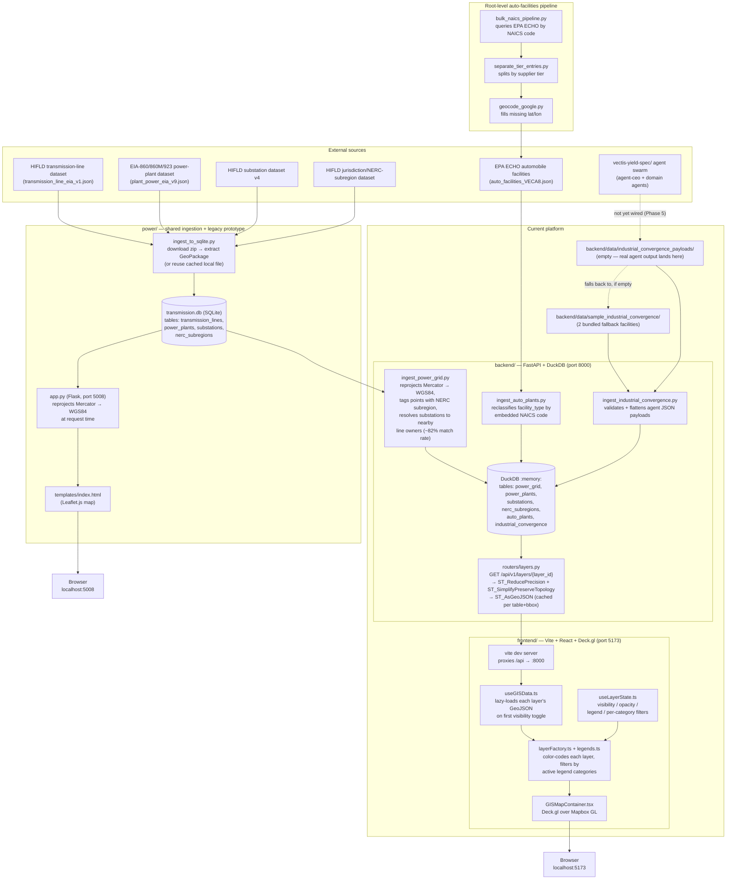

# Vectis Yield

A geospatial platform for tracking industrial/energy "convergence" — where auto
manufacturing, defense hardware, robotics, and grid capacity overlap — layered
on top of real U.S. transmission-grid, power-generation, and automobile
manufacturing facility data.

There are currently **two codebases in this repo**:

- **`backend/` + `frontend/`** — the target architecture (FastAPI + DuckDB
  spatial backend, React + Deck.gl + Mapbox frontend). This is what's under
  active development and what the rest of this doc describes.
- **`power/`** — an earlier Flask + SQLite + Leaflet prototype (port 5008,
  not started by [start.sh](start.sh)). It's still functional
  (`python power/app.py`) and is where the real EIA/HIFLD ingestion logic
  (`power/ingest_to_sqlite.py`) lives — the FastAPI backend reads its output
  (`transmission.db`) rather than duplicating that scraping/parsing logic —
  but the Flask+Leaflet UI itself isn't the direction the product is going.

See [`Unified_Vectis_Yield_Build_Guide.md`](Unified_Vectis_Yield_Build_Guide.md)
for the phased build plan and [`Platform_spec.md`](Platform_spec.md) for the
full target architecture spec.

## Status: what's real vs. mock right now

The app renders five map layers, all backed by real data:

| Layer | Backed by | Features |
|---|---|---|
| **NERC Subregions** | HIFLD jurisdiction/NERC-subregion dataset | 22 subregion polygons (background context, visible by default) |
| **Transmission Lines** | HIFLD transmission-line dataset (filename says EIA — content is HIFLD) | 94,619 line segments |
| **Power Plants** | EIA-860/860M/923 generating-unit dataset | 12,798 facilities |
| **Substations** | HIFLD electric substation dataset v4 | 74,428 facilities |
| **Automobile Manufacturing Facilities** | EPA ECHO, reclassified by NAICS code (see [`backend/ingest_auto_plants.py`](backend/ingest_auto_plants.py)) | 6,935 facilities |

There's also a sixth layer, **Industrial Convergence**, fully implemented on
the backend (table, ingestion, `/api/v1/layers/industrial-convergence`,
corridor-summary endpoint) but **not currently rendered on the map** — the
agent swarm in `vectis-yield-spec/` (`agent-ceo` + domain agents) is meant to
populate it by dropping validated JSON payloads into
`backend/data/industrial_convergence_payloads/`, but the orchestrator isn't
wired up to do that yet (Build Guide Phase 5). It falls back to 2 bundled
sample facilities in the meantime, and the frontend's `LayerId` type
deliberately excludes it until real payloads exist.

Each real-data layer has its own selectable legend in the layer panel:
Transmission Lines and Substations are both colored/filterable by voltage
bucket (same palette, independent selection state per layer); Power Plants
by fuel type (11 buckets); Automobile Manufacturing Facilities by NAICS-derived
role (10 buckets — OEM Assembly, Body/Engine/Electrical/Steering/Brake/
Transmission/Stamping manufacturing, etc.); NERC Subregions by region (8 top-
level regions). Clicking a legend entry shows/hides just that category; each
layer also gets an All/None button to clear a layer down to nothing and build
a selection back up one category at a time.

## Data flow



Key details worth remembering:

- **Reprojection happens twice, in two different places, using the same
  math.** The source GEM-tool data is in Web Mercator (EPSG:3857).
  `power/app.py` reprojects to WGS84 lazily, per-request, at serve time.
  `backend/ingest_power_grid.py` reprojects once, eagerly, at DuckDB seed
  time (necessary because DuckDB's spatial functions need WGS84 to line up
  bboxes with the other layers).
- **Auto-facilities data arrives as plain JSON, not a GeoPackage**, so it's
  ingested directly by `backend/ingest_auto_plants.py` rather than via
  `power/ingest_to_sqlite.py` + SQLite — the same direct-JSON approach
  `ingest_industrial_convergence.py` already used. All 6,935 records in
  `auto_facilities_VECA8.json` carry real coordinates.
- **Coordinates are snapped and simplified before serialization.**
  `backend/database.py` reduces every coordinate to ~1.1m precision
  (`ST_ReducePrecision`, 0.00001°) and applies Douglas-Peucker simplification
  on top (`ST_SimplifyPreserveTopology`) — 0.0001° (~11m) for NERC subregions,
  0.00003° (~3m) for everything else. This cut transmission-line payload
  size from ~48MB to ~11MB gzipped, NERC subregions from ~18MB to ~4MB
  gzipped, with no visible difference at map scale. Responses are also
  gzip-compressed (FastAPI `GZipMiddleware`) and cached in-process per
  `(table, bbox)` for the life of the process.
- **`transmission.db` and the raw source exports are not committed.** They're
  gitignored (large — hundreds of MB) along with `auto_facilities_VECA8.json`'s
  raw upstream inputs. A local gzip-compressed backup of both the input
  sources and pipeline outputs lives in `data_backup/` (also gitignored —
  see [`data_backup/CATALOG.md`](data_backup/CATALOG.md) for what's backed up
  and how to restore it). Regenerate the live files from scratch via
  [Regenerating the real data](#regenerating-the-real-data) below.
- **DuckDB is in-memory and rebuilt from scratch on every backend restart.**
  There's no persistence layer for the DuckDB tables themselves; SQLite
  (`transmission.db`), `auto_facilities_VECA8.json`, and the JSON payload
  files are the durable sources of truth.

## Directory layout

```text
vectis/
├── backend/                          # FastAPI + DuckDB spatial API (port 8000)
│   ├── main.py                       # app entrypoint, CORS, GZip middleware, /health
│   ├── database.py                   # DuckDB seeding orchestration, precision/cache logic
│   ├── ingest_auto_plants.py         # EPA ECHO JSON → DuckDB, NAICS reclassification
│   ├── ingest_power_grid.py          # SQLite → DuckDB, real EIA/HIFLD data, NERC tagging
│   ├── ingest_industrial_convergence.py  # agent payload JSON → DuckDB
│   ├── trace.py                      # network-trace graph (facility → subregion)
│   ├── routers/layers.py             # GET /api/v1/layers/{layer_id}, corridor-summary
│   └── data/
│       ├── industrial_convergence_payloads/  # real agent-swarm drop dir (empty)
│       └── sample_industrial_convergence/    # bundled fallback facilities
├── frontend/                         # Vite + React + Deck.gl + Mapbox (port 5173)
│   └── src/
│       ├── components/GISMapContainer.tsx    # map + Deck.gl wiring
│       ├── components/LayerManager.tsx       # layer panel, legends, filters
│       ├── components/OwnerSearch.tsx        # search facilities by owner name
│       ├── components/TracePanel.tsx         # network trace visualization/playback
│       ├── components/FeatureTooltip.tsx     # hover/click feature detail popup
│       ├── hooks/useGISData.ts               # lazy-loads each layer's GeoJSON
│       ├── hooks/useLayerState.ts            # visibility/opacity/legend state
│       ├── hooks/useNetworkTrace.ts          # facility → subregion trace orchestration
│       ├── layers/layerFactory.ts            # Deck.gl layer definitions per layer
│       ├── legends.ts                        # shared color/category logic
│       ├── owners.ts, networkTrace.ts        # owner-search & trace highlight logic
│       └── types/gis.ts                      # LayerId, LayerConfig, feature property types
├── power/                            # Shared ingestion + legacy Flask/SQLite/Leaflet prototype (port 5008)
│   ├── ingest_to_sqlite.py           # downloads + parses real EIA/HIFLD data into transmission.db
│   └── app.py
├── bulk_naics_pipeline.py            # EPA ECHO API → auto_facilities_north_america_master.jsonl
├── separate_tier_entries.py          # splits master jsonl into tier1/tier2/unknown by supplier role
├── geocode_google.py                 # fills missing lat/lon via Google Maps geocoding
├── auto_facilities_VECA8.json        # curated auto-facilities dataset the backend actually loads
├── data_backup/                      # gitignored local backup of input + output datasets (see CATALOG.md)
├── vectis-yield-spec/                # "Paperclip" agent swarm specs (CEO + domain agents)
├── Platform_spec.md                  # target architecture spec
├── Unified_Vectis_Yield_Build_Guide.md   # phased build plan, current source of truth
└── start.sh                          # starts backend (:8000) + frontend (:5173) together
```

## Running it locally

### Quick start

```bash
./start.sh
```

Starts the backend on `http://127.0.0.1:8000` and the frontend on
`http://127.0.0.1:5173` together, and stops both on Ctrl-C.

### Backend (manual)

```bash
cd backend
python3 -m venv .venv && source .venv/bin/activate
pip install -r requirements.txt
uvicorn main:app --reload --port 8000
```

On startup it seeds six DuckDB tables: `auto_plants` (from
`auto_facilities_VECA8.json`, no extra setup needed), `power_grid` /
`power_plants` / `substations` / `nerc_subregions` (from `../transmission.db`
— see [Regenerating the real data](#regenerating-the-real-data) if it doesn't
exist yet), and `industrial_convergence` (bundled sample data, no extra setup
needed). Startup can take a couple of minutes the first time, dominated by
the per-row `ST_GeomFromGeoJSON` inserts for the ~182K transmission/plant/
substation rows.

### Frontend

```bash
cd frontend
npm install
npm run dev
```

Opens on `http://localhost:5173`. The dev server proxies `/api/*` to the
backend at `:8000` (see `vite.config.ts`) — no extra CORS setup needed. You'll
need a Mapbox access token in `frontend/.env` (`VITE_MAPBOX_TOKEN=...`,
gitignored). All layers except NERC Subregions are hidden by default and lazy-
load their GeoJSON the first time you toggle them on.

### Regenerating the real data

`transmission.db` isn't committed (too large). To rebuild it from the real
EIA/HIFLD source data:

```bash
cd power
python3 -m venv .venv && source .venv/bin/activate
pip install -r requirements.txt   # flask, geopandas
python ingest_to_sqlite.py --db ../transmission.db
```

This downloads the transmission-line, power-plant, substation, and NERC-
subregion datasets, converts them, and writes their tables into
`../transmission.db`. Restart the backend afterward to pick it up. If you
already have a substations GeoPackage downloaded locally (e.g. at the repo
root as `electric_substation_hifld_v4/electric_substation_hifld_v4.gpkg`),
`ingest_to_sqlite.py` picks it up automatically instead of re-downloading.
A gzip-compressed copy of all of these raw source files (plus the pipeline
outputs) is kept locally in `data_backup/` — see
[`data_backup/CATALOG.md`](data_backup/CATALOG.md) to restore instead of
re-downloading from scratch.

To regenerate the auto-facilities dataset from EPA ECHO instead of using the
committed `auto_facilities_VECA8.json`, run the root-level pipeline in order:
`bulk_naics_pipeline.py` (queries EPA ECHO by NAICS code) →
`separate_tier_entries.py` (splits by supplier tier) → `geocode_google.py`
(fills missing lat/lon, requires a Google Maps API key).

## Known gaps

- **Industrial Convergence layer has no real data feed and isn't rendered on
  the map.** The `agent-ceo` orchestrator in `vectis-yield-spec/` needs to
  either POST to a new ingest endpoint or drop validated JSON into
  `backend/data/industrial_convergence_payloads/` — neither is wired up yet
  (Build Guide Phase 5). The backend table, ingestion, and API endpoint all
  already exist and work against the bundled sample payloads.
- **Docker Compose deployment** (`Platform_spec.md` §3.3 / Build Guide Phase 6)
  hasn't been exercised — `Dockerfile`s exist for both services but haven't
  been built/tested together.
- **Backend startup takes a couple of minutes** with all real datasets
  loaded (94,619 + 12,798 + 74,428 + 6,935 ≈ 189K rows). DuckDB's per-row
  `ST_GeomFromGeoJSON` insert in `ingest_power_grid.py`/`ingest_auto_plants.py`
  doesn't scale linearly-fast past this volume — noted as a known gap rather
  than fixed, since it's a one-time cost per process start, not per-request.
  Painful if you're iterating with `--reload` and touching backend files
  often, since each save triggers a full rebuild.
- **`approximate_employment` is always null** in the current auto-facilities
  source (EPA ECHO doesn't carry it) — Census County Business Patterns/QCEW
  would be the standard complementary source if this is needed later (see
  [`complementary_data_sources.md`](complementary_data_sources.md)).
