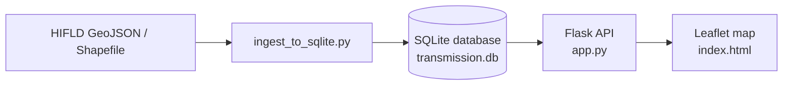

# Local Transmission Grid Web Map

This guide shows how to store a spatial dataset in a local SQLite database and serve it to an interactive web map with Flask and Leaflet.js.

## Architecture overview



## Step 1: Ingest the data into SQLite

This script reads the transmission line dataset with GeoPandas, converts each geometry into a GeoJSON string, and writes the results into a SQLite database.

Install the required Python packages:

```bash
pip install flask geopandas
```

Create a file named `ingest_to_sqlite.py` with the following content:

```python
import sqlite3
import geopandas as gpd
import json


def build_transmission_db(geojson_path="Electric_Power_Transmission_Lines.geojson", db_path="transmission.db"):
    print("Loading GeoJSON data into GeoPandas...")
    gdf = gpd.read_file(geojson_path)

    # Filter out non-contiguous US territories for clean rendering
    gdf = gdf[~gdf["STATE"].isin(["AK", "HI", "PR", "VI", "GU"])].copy()

    print(f"Connecting to SQLite database '{db_path}'...")
    conn = sqlite3.connect(db_path)
    cursor = conn.cursor()

    cursor.execute("DROP TABLE IF EXISTS transmission_lines")
    cursor.execute("""
        CREATE TABLE transmission_lines (
            id INTEGER PRIMARY KEY AUTOINCREMENT,
            owner TEXT,
            voltage INTEGER,
            volt_class TEXT,
            status TEXT,
            state TEXT,
            geojson_geom TEXT
        )
    """)

    print("Inserting records into the SQL database...")
    records = []
    for _, row in gdf.iterrows():
        geom_str = json.dumps(row.geometry.__geo_interface__) if row.geometry else None

        records.append((
            str(row.get("OWNER", "Unknown")),
            int(row.get("VOLTAGE", 0)) if row.get("VOLTAGE") is not None else 0,
            str(row.get("VOLT_CLASS", "N/A")),
            str(row.get("STATUS", "N/A")),
            str(row.get("STATE", "")),
            geom_str,
        ))

    cursor.executemany("""
        INSERT INTO transmission_lines (owner, voltage, volt_class, status, state, geojson_geom)
        VALUES (?, ?, ?, ?, ?, ?)
    """, records)

    cursor.execute("CREATE INDEX idx_voltage ON transmission_lines(voltage)")
    cursor.execute("CREATE INDEX idx_state ON transmission_lines(state)")

    conn.commit()
    conn.close()
    print("Database built successfully!")


if __name__ == "__main__":
    build_transmission_db()
```

## Step 2: Create the Flask API

This lightweight backend queries the SQLite database and serves the dataset as a GeoJSON endpoint for the browser.

Create a file named `app.py` with the following content:

```python
from flask import Flask, jsonify, render_template, request
import sqlite3
import json

app = Flask(__name__)


def get_db_connection():
    conn = sqlite3.connect("transmission.db")
    conn.row_factory = sqlite3.Row
    return conn


@app.route("/")
def home():
    return render_template("index.html")


@app.route("/api/lines")
def api_get_lines():
    """
    Returns transmission lines from SQLite as GeoJSON.
    Supports filtering with the min_voltage query parameter.
    """
    min_voltage = request.args.get("min_voltage", default=100, type=int)

    conn = get_db_connection()
    cursor = conn.cursor()

    query = """
        SELECT id, owner, voltage, volt_class, status, state, geojson_geom
        FROM transmission_lines
        WHERE voltage >= ?
    """
    rows = cursor.execute(query, (min_voltage,)).fetchall()
    conn.close()

    features = []
    for row in rows:
        if not row["geojson_geom"]:
            continue

        features.append({
            "type": "Feature",
            "properties": {
                "id": row["id"],
                "owner": row["owner"],
                "voltage": row["voltage"],
                "volt_class": row["volt_class"],
                "status": row["status"],
                "state": row["state"],
            },
            "geometry": json.loads(row["geojson_geom"]),
        })

    return jsonify({
        "type": "FeatureCollection",
        "features": features,
    })


if __name__ == "__main__":
    app.run(debug=True, port=5000)
```

## Step 3: Create the Leaflet map page

Create a folder named `templates`, then save the following as `templates/index.html`. It uses Leaflet.js to fetch data from `/api/lines` and draw the transmission grid on an interactive map.

```html
<!DOCTYPE html>
<html lang="en">
<head>
    <meta charset="UTF-8">
    <title>U.S. Transmission Grid Map</title>
    <link rel="stylesheet" href="https://unpkg.com/leaflet@1.9.4/dist/leaflet.css" />
    <style>
        body { margin: 0; padding: 0; font-family: sans-serif; }
        #map { height: 100vh; width: 100vw; }
        .control-panel {
            position: absolute;
            top: 10px;
            right: 10px;
            z-index: 1000;
            background: white;
            padding: 15px;
            border-radius: 8px;
            box-shadow: 0 0 15px rgba(0,0,0,0.2);
        }
    </style>
</head>
<body>
    <div class="control-panel">
        <h3>U.S. Grid Filter</h3>
        <label for="voltageSelect">Minimum Voltage:</label>
        <select id="voltageSelect" onchange="loadGridData()">
            <option value="69">69 kV (All Lines)</option>
            <option value="161">161 kV</option>
            <option value="230" selected>230 kV</option>
            <option value="345">345 kV</option>
            <option value="500">500 kV+</option>
        </select>
        <p><small id="statusText">Loading map data...</small></p>
    </div>

    <div id="map"></div>

    <script src="https://unpkg.com/leaflet@1.9.4/dist/leaflet.js"></script>
    <script>
        const map = L.map("map").setView([39.8283, -98.5795], 5);

        L.tileLayer("https://{s}.basemaps.cartocdn.com/dark_all/{z}/{x}/{y}{r}.png", {
            attribution: "&copy; OpenStreetMap &copy; CARTO",
            maxZoom: 19,
        }).addTo(map);

        let geojsonLayer = null;

        function getLineColor(voltage) {
            if (voltage >= 500) return "#e6194B";
            if (voltage >= 345) return "#f58231";
            if (voltage >= 230) return "#ffe119";
            return "#3cb44b";
        }

        function loadGridData() {
            const minVoltage = document.getElementById("voltageSelect").value;
            const statusText = document.getElementById("statusText");
            statusText.innerText = "Querying SQL database...";

            fetch(`/api/lines?min_voltage=${minVoltage}`)
                .then((response) => response.json())
                .then((data) => {
                    if (geojsonLayer) {
                        map.removeLayer(geojsonLayer);
                    }

                    geojsonLayer = L.geoJSON(data, {
                        style: function (feature) {
                            return {
                                color: getLineColor(feature.properties.voltage),
                                weight: feature.properties.voltage >= 345 ? 2.5 : 1.2,
                                opacity: 0.8,
                            };
                        },
                        onEachFeature: function (feature, layer) {
                            layer.bindPopup(`
                                <strong>Owner:</strong> ${feature.properties.owner}<br>
                                <strong>Voltage:</strong> ${feature.properties.voltage} kV<br>
                                <strong>Status:</strong> ${feature.properties.status}<br>
                                <strong>State:</strong> ${feature.properties.state}
                            `);
                        },
                    }).addTo(map);

                    statusText.innerText = `Loaded ${data.features.length} line segments.`;
                })
                .catch((err) => {
                    console.error("Error loading transmission data:", err);
                    statusText.innerText = "Failed to load data.";
                });
        }

        loadGridData();
    </script>
</body>
</html>
```

## How to run

1. Run the ingestion script once to populate `transmission.db`:

```bash
python ingest_to_sqlite.py
```

2. Start the Flask server:

```bash
python app.py
```

3. Open your browser and navigate to `http://localhost:5000`.
